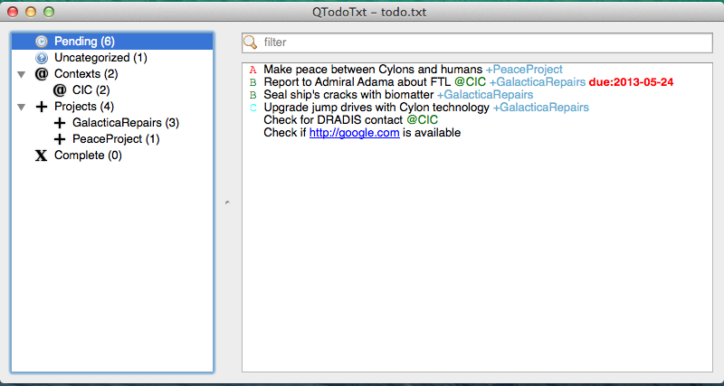

# QTodoTxt [](https://travis-ci.org/mNantern/QTodoTxt)

QTodoTxt is a cross-platform UI client for todo.txt files (see [todo.txt](http://todotxt.com)).



## Downloads

Latest stable release (v1.4.0):

- For Ubuntu: [deb package](http://dl.bintray.com/mnantern/deb/qtodotxt_1.4.0_all.deb)
- For Windows: [Windows installer](http://dl.bintray.com/mnantern/generic/qtodotxt_1.4.0.exe)
- For Mac OS X: [Mac Os X installer](http://dl.bintray.com/mnantern/generic/QTodoTxt_1.4.0.dmg)
- Linux: [tar.gz archive](https://github.com/mNantern/QTodoTxt/archive/1.4.0.tar.gz)

For Debian/Ubuntu you can also add the following repo to your sources.list:


```
echo "deb http://dl.bintray.com/mnantern/deb /" | sudo tee -a /etc/apt/sources.list.d/qtodotxt.list
```

## Running from sources

To run the application without installing just:

* Download [latest code archive](https://github.com/mNantern/QTodoTxt/archive/master.zip)
* Run:
  * On Linux/Mac: bin/qtodotxt
  * On Windows: bin/qtodotxt.pyw
 
Be sure to have all [prerequisites](documentation/User-documentation) installed !

## Documentation

- [User documentation](documentation/User-documentation.md)
- Stable and older releases: [Downloads](documentation/Releases.md)
- [Changelog](documentation/Changelog.md)
- [Defects and Enhancements](https://github.com/mNantern/QTodoTxt/issues)
- [Screenshots](documentation/Screenshots.md)
- [Forum](https://groups.google.com/d/forum/qtodotxt)
